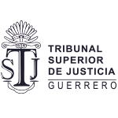
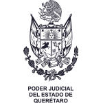
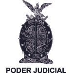
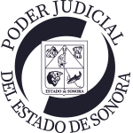
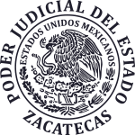
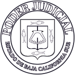
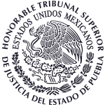
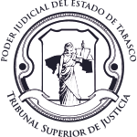

Title: Directorio de Unidades CONATRIB
Slug: directorio-de-unidades-conatrib
Summary: .
Category: Directorio de Unidades CONATRIB
URL: directorio-de-unidades-conatrib/
Save_As: directorio-de-unidades-conatrib/index.html
Date: 2020-01-01 00:00
Modified: 2020-01-01 00:00

### TSJ Aguascalientes

- **Nombre de la unidad** Unidad de Igualdad de Género
- **Fecha de creación** 13 de octubre de 2014
- **Nombre del enlace** Lic. Rosalba Ramírez Salazar
- **Puesto** Encargada de la Unidad
- **Teléfono** 4499103550 ext.4427
- **Correo electrónico** rosalbaramirezsalazar@gmail.com

---

### TSJ Campeche

- **Nombre de la unidad** Unidad de derechos humanos e igualdad
- **Fecha de creación** 10 de febrero de 2014
- **Nombre del enlace** Felipa Guadalupe Cáceres Horta
- **Puesto** Titular interina de la Unidad
- **Teléfono** 9818130664 ext. 1050 y 1051
- **Correo electrónico** derechoshumanostsj@hotmail.com

---

### TSJ Ciudad de México

- **Nombre de la unidad** Dirección Ejecutiva de Orientación Ciudadana y Derechos Humanos, tiene dentro de su estructura la Subdirección de Género.
- **Fecha de creación** 5 de junio de 2000
- **Nombre del enlace** Maestra Ma. Elena Lugo del Castillo
- **Puesto** Directora de Orientación Ciudadana y Derechos Humanos
- **Teléfono** 5552313526
- **Correo electrónico** elena.lugo@tsjcdmx.gob.mx

---

### TSJ Durango

- **Nombre de la unidad** Unidad de Derechos Humanos e Igualdad de Género.
- **Fecha de creación** 22 de abril de 2015
- **Nombre del enlace** Mtra. Fabiola Ortega
- **Puesto** Titular de la Unidad
- **Teléfono** 6188114712 ext. 157
- **Correo electrónico** uddhhig@pjdgo.gob.mx

---

### TSJ Guerrero

- **Nombre de la unidad** Coordinación de la Unidad de Igualdad de Género y Derechos Humanos.
- **Fecha de creación** 21 de mayo de 2015
- **Nombre del enlace** Lic. Berenice Jáuregui Alarcón
- **Puesto** Titular de la Unidad
- **Teléfono** 7474943200 ext. 224
- **Correo electrónico** berejau3@gmail.com

---

### TSJ Michoacán

- **Nombre de la unidad** Unidad de Igualdad de Género, Derechos Humanos y Derechos Indígenas.
- **Fecha de creación** 15 de julio de 2015
- **Nombre del enlace** Lic. Citlalli Fernández González
- **Puesto** Directora de la Unidad
- **Teléfono** 4433109508
- **Correo electrónico** unidad.generodhi@gmail.com

---

### TSJ Nuevo León

- **Nombre de la unidad** Dirección de Equidad de Género y Protección a Grupos Vulnerables.
- **Fecha de creación**
- 3 de septiembre de 2013
- **Nombre del enlace** Dra. Myrna Elia García Barrera
- **Puesto** Directora
- **Teléfono** 8120206429
- **Correo electrónico** myrna.garcia@pjenl.gob.mx

---

### TSJ Querétaro

- **Nombre de la unidad** Unidad de Igualdad de Género.
- **Fecha de creación** 1 de mayo de 2015
- **Nombre del enlace** Ruth Homs Tirado
- **Puesto** Titular de la Unidad
- **Teléfono** 4423032261 y 61 ext. 220
- **Correo electrónico** rhoms@tribunalqro.gob.mx

---

### TSJ Sinaloa

- **Nombre de la unidad** Comisión para los Derechos Humanos e Igualdad de Género.
- **Fecha de creación** 22 de abril de 2016
- **Nombre del enlace** Lic. Claudia Yuridia Meza Avendaño
- **Puesto** Secretaria de Estudio y Cuenta
- **Teléfono** 6672133591
- **Correo electrónico** claudiayma23@gmail.com

---

### TSJ Tamaulipas

- **Nombre de la unidad** Unidad de Igualdad de Género y Derechos Humanos.
- **Fecha de creación** 1 de julio de 2014
- **Nombre del enlace** Marcia Benavides Villafuerte
- **Puesto** Titular de la Unidad
- **Teléfono** 800007373
- **Correo electrónico** marcia.benavides@tam.gob.mx

---

### TSJ Yucatán

- **Nombre de la unidad** Unidad de Igualdad de Género.
- **Fecha de creación** 6 de febrero de 2013
- **Nombre del enlace** Mag. Ligia Aurora Cortes Ortega
- **Puesto** Enlace
- **Teléfono** 9999300650 ext. 3102
- **Correo electrónico** ligia.cortes@tsjyuc.gob.mx

---

### TSJ Baja California

- **Nombre de la unidad** Unidad de Igualdad de Género.
- **Fecha de creación** 9 de julio de 2015
- **Nombre del enlace** Mag. Sonia Mireya Beltrán Almada
- **Puesto** Enlace
- **Teléfono** 6869045000 ext. 1340
- **Correo electrónico** sonia.beltran@pjbc.gob.mx

---

### TSJ Chiapas

- **Nombre de la unidad** Dirección de Igualdad de Género y Derechos Humanos.
- **Fecha de creación** 8 de diciembre 2010
- **Nombre del enlace** Lic. Maria Silinia Aguilar Avendaño
- **Puesto** Directora
- **Teléfono** 019616178700 ext. 8480
- **Correo electrónico** siliaguilar@hotmail.com

---

### TSJ Coahuila

- **Nombre de la unidad** Unidad de Derechos Humanos e Igualdad de Género.
- **Fecha de creación** 13 de junio de 2017
- **Nombre del enlace** Ma. Guadalupe J. Hernández Bonilla
- **Puesto** Titular de la Unidad
- **Teléfono** 844-439-14-19
- **Correo electrónico** ghbonilla@gmail.com

---

### TSJ Estado de México

- **Nombre de la unidad** Unidad de Igualdad y Derechos Humanos.
- **Fecha de creación** 8 de julio de 2013
- **Nombre del enlace** Lic. Ma. Remedios Monroy Cruz
- **Puesto** Titular de la Unidad
- **Teléfono** 7221679200 ext. 16672 y 16673
- **Correo electrónico** unidad.igualdadyddh@pjedomex.gob.mx

---

### TSJ Hidalgo

- **Nombre de la unidad** Unidad para la Igualdad de Género y Derechos Humanos.
- **Fecha de creación** 22 de abril de 2014
- **Nombre del enlace** Lic. María Guadalupe González Olvera
- **Puesto** Titular de la Unidad
- **Teléfono** 7717179000 ext. 9293
- **Correo electrónico** unigdh@hotmail.com

---

### TSJ Morelos

- **Nombre de la unidad** Unidad de Igualdad de Género y Derechos Humanos.
- **Fecha de creación** 25 de Agosto de 2015
- **Nombre del enlace** Lic. María del Consuelo Estada Soto
- **Puesto** Coordinadora de la Unidad
- **Teléfono** 7773101545
- **Correo electrónico** unidadigualdadgenero.mor@gmail.com

---

### TSJ Oaxaca

- **Nombre de la unidad** Dirección de Derechos Humanos del Consejo de la Judicatura.
- **Fecha de creación** 28 de Abril 2012
- **Nombre del enlace** Dr. Ángel Rafael Díaz Ortiz
- **Puesto** Director
- **Teléfono** 9516885897
- **Correo electrónico** derechoshumanos@tribunaloaxaca.gob.mx

---

### TSJ Quintana Roo

- **Nombre de la unidad** Unidad de Derechos Humanos
- **Fecha de creación** 17 de octubre de 2017
- **Nombre del enlace** Mag. Mariana Dávila Goerner
- **Puesto** Magistrada Titular de la Séptima Sala Especializada en Materia Familiar y Materia Familiar Oral
- **Teléfono** 9988810230 ext. 247
- **Correo electrónico** mdavila@tsjqroo.gob.mx ncano@tsjqroo.gob.mx

---

### TSJ Sonora

- **Nombre de la unidad** Unidad de Igualdad de Género.
- **Fecha de creación** 25 de abril de 2014
- **Nombre del enlace** Lic. Sanae Mercedes Hinojosa Taomori
- **Puesto** Encargada de la Unidad
- **Teléfono** 6622175461 ext. 117
- **Correo electrónico** unidad.genero@stjsonora.gob.mx

---

### TSJ Tlaxcala

- **Nombre de la unidad** Unidad de Igualdad de Género.
- **Fecha de creación** 8 de abril de 2015
- **Nombre del enlace** Alejandra Olvera Sánchez
- **Puesto** Jefa de la Unidad
- **Correo electrónico** igualdadgenerotlaxcala@hotmail.com

---

### TSJ Zacatecas

- **Nombre de la unidad** Oficina de Equidad de Género y Derechos Humanos.
- **Fecha de creación** 11 de marzo de 2011
- **Nombre del enlace** Lic. Marisa Álvarez Crespo
- **Puesto** Jefa de la Oficina
- **Teléfono** 4929221584 Ext. 4304,4103
- **Correo electrónico** marisa_alcres@hotmail.com

---

### TSJ Baja California Sur

- **Nombre de la unidad** Unidad de Igualdad de Género y Derechos Humanos.
- **Fecha de creación** 1 de febrero de 2015
- **Nombre del enlace** Lic. Belsen Sarel Carlon Ayaquica
- **Puesto** Titular de la Unidad
- **Teléfono** 6121238900 ext. 1039
- **Correo electrónico** generotsj_bcs@hotmail.com

---

### TSJ Chihuahua

- **Nombre de la unidad** Unidad de Igualdad de Género y Derechos Humanos.
- **Fecha de creación** 19 de noviembre de 2014
- **Nombre del enlace** Lic. Verónica Rodríguez López
- **Puesto** Titular de la Unidad
- **Teléfono** 6141800700 ext. 29324
- **Correo electrónico** veronica.rodriguezl@stj.gob.mx

---

### TSJ Colima

- **Nombre de la unidad** Unidad de Género y Derechos Humanos.
- **Fecha de creación** 11 de marzo de 2014
- **Nombre del enlace** Lizette Sarahí Enríquez Valencia
- **Puesto** Titular de la Unidad
- **Teléfono** 3126906516 ext.2217
- **Correo electrónico** genero_derechoshumanos@stjcolima.gob.mx

---

### TSJ Guanajuato

- **Nombre de la unidad** Secretaría Ejecutiva del Comité de Igualdad de Género y Derechos Humanos.
- **Fecha de creación** 29 de noviembre de 2012
- **Nombre del enlace** Lic. Martha Alicia Muñoz Ortiz
- **Puesto** Titular del Comité
- **Teléfono** 4737352200 ext.1109
- **Correo electrónico** alicia.munoz@poderjudicial-gto.gob.mx

---

### TSJ Jalisco

- **Nombre de la unidad** Unidad para la Igualdad de Género y Derechos Humanos.
- **Fecha de creación** 21 de mayo de 2014
- **Nombre del enlace** Mag. Verónica Elizabeth Ucaranza Sánchez
- **Puesto** Enlace
- **Teléfono** 3312001400 o 1500 Ext. 408 y 372 Informática 355 y 528
- **Correo electrónico** generostj@gmail.com

---

### TSJ Nayarit

- **Nombre de la unidad** Comisión de Derechos Humanos e Igualdad de Género.
- **Fecha de creación** 28 de febrero de 2012
- **Nombre del enlace** Mag. Ana Isabel Velasco García
- **Puesto** Enlace
- **Teléfono** 3112154721
- **Correo electrónico** avelasco@tsjnay.gob.mx

---

### TSJ Puebla

- **Nombre de la unidad** Presidenta de la Comisión de Derechos Humanos.
- **Fecha de creación** 24 de noviembre de 2011
- **Nombre del enlace** Mag. Marcela Martínez Morales
- **Puesto** Enlace
- **Teléfono** 2222238449
- **Correo electrónico** mmmorales@htsjpuebla.gob.mx

---

### TSJ San Luis Potosí

- **Nombre de la unidad** Comisión Mixta de Derechos Humanos e Igualdad de Género.
- **Fecha de creación** 30 de abril de 2015
- **Nombre del enlace** Lic. Celene Velázquez Gutiérrez
- **Puesto** Enlace
- **Teléfono** 4448268568
- **Correo electrónico** cvelazquezg@cjslp.gob.mx

---

### TSJ Tabasco

- **Nombre de la unidad** Unidad de Igualdad de Género y Derechos Humanos.
- **Fecha de creación** 28 de Mayo del 2015
- **Nombre del enlace** Mtra. Irma Salazar Méndez
- **Puesto** Directora de la Unidad de Igualdad de Género y Derechos Humanos
- **Teléfono** 9333582000 Ext. 4315
- **Correo electrónico** irma.salazar@tsj-tabasco.gob.mx

---

### TSJ Veracruz

- **Nombre de la unidad** Unidad de Género.
- **Fecha de creación** 4 de agosto de 2015
- **Nombre del enlace** Mtra. Haydee Campos González
- **Puesto** Titular de la Unidad
- **Teléfono** 2288422800 ext. 17150 y 17151
- **Correo electrónico** unidad.genero@tjeveracruz.gob.mx
